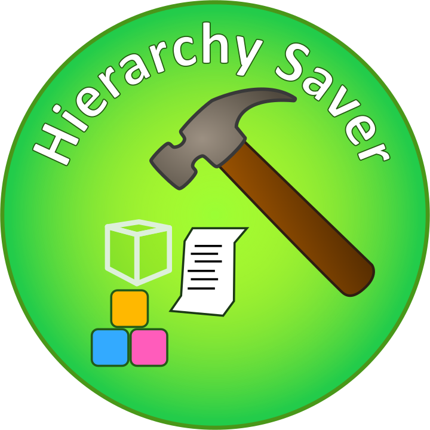

# HierarchySaver
A free and open-source plugin that converts (or compiles) Roblox instances into clean, readable Luau code - including support for certain Luau-based DSLs. Built by Yarik_superpro with a focus on customization, formatting options, and promoting open-source development.
Get Hierarchy Saver on roblox marketplace: https://create.roblox.com/store/asset/122426584119143/Hierarchy-Saver

